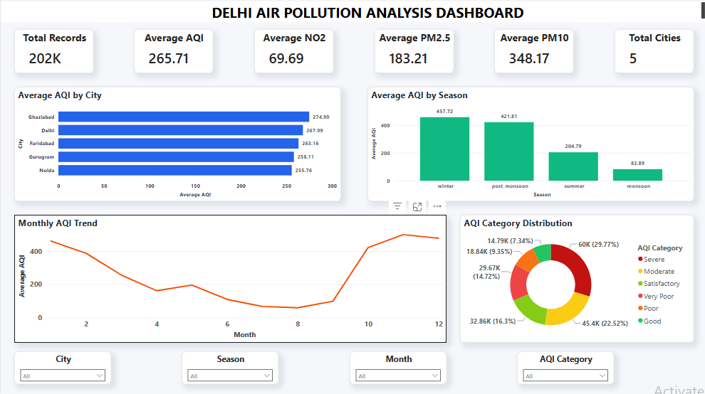
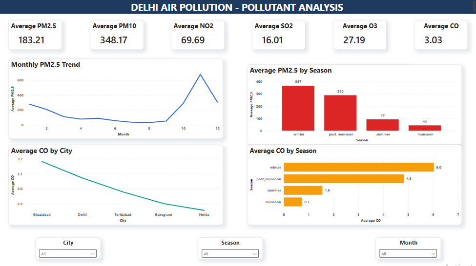
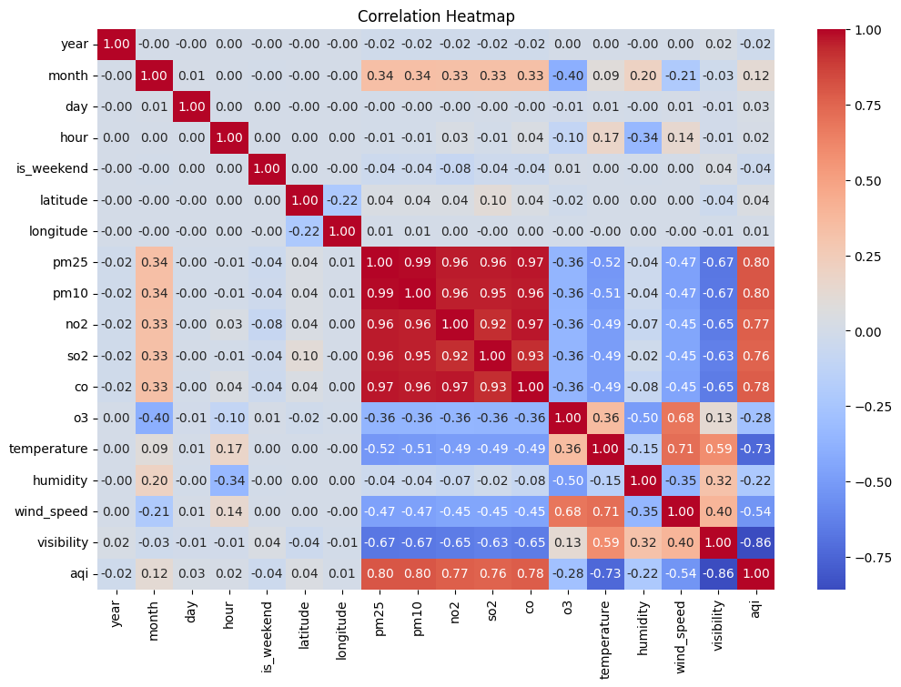
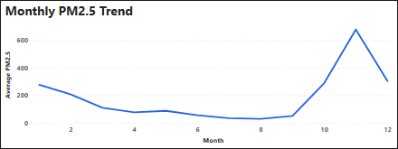

# Delhi Air Pollution Analysis 🌫️

Analysis of 200,000+ air quality records across Delhi to uncover pollution trends, seasonal patterns, and city-wise comparisons — combining Python for data processing, SQL for querying, and Power BI for visualization.

## 📌 Overview

Delhi consistently ranks among the most polluted cities in the world. This project analyzes historical air quality data to identify pollution patterns across seasons and locations, with the goal of surfacing insights that could inform public health awareness and environmental policy decisions.

The workflow spans the full analytics pipeline: data cleaning and preprocessing in Python, exploratory analysis and querying in SQL, and interactive visualization in Power BI.

## 🎯 Objectives

- Clean and prepare a large, real-world air quality dataset for analysis
- Identify seasonal and city-wise pollution trends across key pollutants
- Build an optimized SQL query layer for repeatable analysis
- Design an interactive dashboard to make findings accessible to non-technical stakeholders

## 🛠️ Tech Stack

| Category | Tools |
|---|---|
| Data Processing | Python (Pandas) |
| Querying & Analysis | SQL (SQLite) |
| Visualization | Power BI |
| Version Control | Git / GitHub |

## 📊 Dataset

- **File:** [`data/delhi_air_pollution_sample.csv`](data/delhi_air_pollution_sample.csv)
- **Size:** 200,000+ records
- **Metrics tracked:** AQI, PM2.5, PM10, NO₂, CO, and other key pollutants
- **Granularity:** City-wise and time-series (seasonal) data


## 🔍 Methodology

1. **Data Cleaning & Preprocessing** — Handled missing values, corrected data types, and standardized formats using Pandas.
2. **Exploratory Data Analysis (EDA)** — Examined distributions, trends, and correlations across pollutants and time periods.
3. **Feature Engineering** — Derived seasonal and time-based features to support trend analysis.
4. **SQL Analysis** — Built and optimized 20+ SQL queries in SQLite to analyze pollutant trends, seasonal patterns, and city-wise comparisons.
5. **Dashboard Design** — Developed a two-page interactive Power BI dashboard with KPI cards, line charts, bar charts, and slicers.

## 📈 Key Insights

- Winter recorded the highest average AQI(~458) , while the monsoon season had the lowest (~83) , indicating a strong seasonal impact on air quality.
- Ghaziabad, Delhi , Faridabad , Gurugram and Noida consistently reported the highest average AQI , highlighting major pollution hotspots in the NCR region.
- PM2.5 concentration showed a strong positive relationship with AQI, making it one of the primary contributors to poor air quality.
- Air pollution increased significantly during the post-monsoon and winter seasons, likely due to reduced wind speed, temperature inversion, and stubble burning.
- Monsoon rainfall significantly reduced pollutant concentrations, resulting in the cleanest air quality among all seasons.
- Monthly trend analysis revealed recurring seasonal pollution patterns, with pollutant levels peaking during colder months.
- Correlation analysis showed strong positive relationships among major pollutants, suggesting that multiple pollutants increase simultaneously under adverse atmospheric conditions.
- Interactive Power BI dashboards enabled comparison of pollution trends by city, month, and season using dynamic filters and KPI cards.
- SQL analysis helped identify pollution hotspots, seasonal trends, and city-wise pollutant averages through 20+ business-focused analytical queries.
- The analysis provides actionable insights that can support environmental monitoring, pollution control strategies, and policy planning.

```
## 📷 Dashboard Preview

**Dashboard — Page 1**



**Dashboard — Page 2**



**Pollution Heatmap**



**Monthly PM2.5 Trend**



## 📁 Repository Structure

```
delhi-air-pollution-analysis/
├── data/
│   └── delhi_air_pollution_sample.csv       # Raw/sample air pollution dataset
├── notebooks/
│   └── Delhi_Air_Pollution_Analysis.ipynb   # Python (Pandas) EDA & preprocessing
├── sql/
│   └── Air_Pollution_Sql_Queries.sql        # SQL queries used for analysis
├── power bi/
│   └── Delhi_Air_Pollution_Dashboard.pbix   # Power BI dashboard file
├── images/
│   ├── Dashboard_page1.png                  # Dashboard screenshot — page 1
│   ├── Dashboard_Page2.png                  # Dashboard screenshot — page 2
│   ├── Heatmap.png                          # Pollution heatmap visual
│   └── Monthly_PM2.5.png                    # Monthly PM2.5 trend chart
└── README.md
```
## 🚀 How to Run

1. Clone the repository
   ```bash
   git clone https://github.com/Sakshi-Deshwal/Delhi-Air-Pollution-Analysis.git
   ```
2. Install dependencies
   ```bash
   pip install pandas numpy
   ```
3. Open and run `notebooks/Delhi_Air_Pollution_Analysis.ipynb` to reproduce the data cleaning, EDA, and feature engineering
4. Run the queries in `sql/Air_Pollution_Sql_Queries.sql` in your preferred SQLite client to reproduce the SQL analysis
5. Open `power bi/Delhi_Air_Pollution_Dashboard.pbix` in Power BI Desktop to explore the interactive dashboard

```
## ✅ Conclusion

This project demonstrates an end-to-end data analysis workflow using **Python, Pandas, SQL (SQLite), and Power BI** to analyze Delhi air pollution data. Through data cleaning, exploratory data analysis (EDA), SQL-based business queries, and interactive dashboards, the project identified seasonal pollution trends, city-wise pollution hotspots, and the impact of major pollutants on overall air quality.

The analysis highlights that pollution levels increase significantly during the winter season, with **PM2.5** emerging as one of the major contributors to poor air quality. The insights and recommendations derived from this project can support data-driven environmental planning, pollution control strategies, and informed decision-making.

This project showcases practical skills in **data cleaning, data visualization, SQL querying, business insight generation, and dashboard development**, making it a complete end-to-end Data Analyst portfolio project.

```
## 💡 Recommendations

- Implement stricter vehicle emission standards and encourage the adoption of electric vehicles to reduce urban air pollution.
- Strengthen industrial emission monitoring and ensure compliance with environmental regulations in high-pollution zones.
- Increase public awareness campaigns promoting carpooling, public transport, and sustainable commuting practices.
- Expand urban green spaces and tree plantation initiatives to improve air quality and reduce particulate matter.
- Introduce targeted pollution control measures during winter and post-monsoon seasons when AQI levels are highest.
- Enhance real-time air quality monitoring systems to support timely public health advisories and policy decisions.
- Encourage the use of cleaner fuels and renewable energy sources to reduce emissions from residential and industrial sectors.
- Develop city-specific pollution mitigation strategies, prioritizing high-risk areas such as Ghaziabad, Delhi, Faridabad, Gurugram, and Noida.

## 🙋 Author

**Sakshi Deshwal**
📧 sakshideshwal312@gmail.com
🔗 [LinkedIn](https://linkedin.com/in/sakshi-deshwal) | [GitHub](https://github.com/Sakshi-Deshwal)
